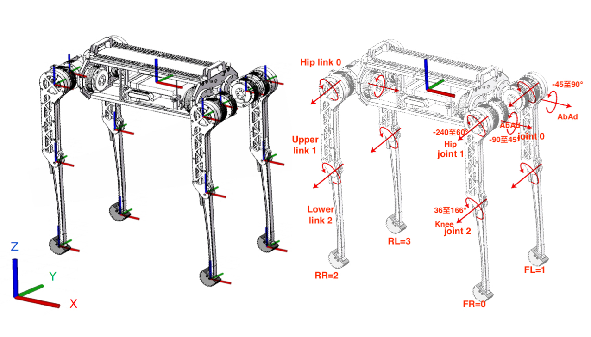

### Basic Definition

**Joint limitation**

| Joint      | LowerBound | UpperBound |
| ---------- | ---------- | ---------- |
| Ab/Ad (hx) | -90°/-45°  | 45°/90°    |
| Hip (hy)   | -240°      | 60°        |
| Knee (kn)  | 36°        | 166°       |

**Size and mass parameters**

| Part        | Length                 | Mass      |
| ----------- | ---------------------- | --------- |
| Hip link    | 0.1                    | 0.766     |
| Upper link  | 0.3                    | 1.598     |
| Lower link  | 0.34                   | 0.363     |
| Motor rotor | -                      | 0.084     |
| Body        | 0.5779 x 0.152 x 0.153 | 13.777    |
| Total robot | -                      | **26.35** |

### References

- [MiLAB-Cheetah-Software](https://github.com/AWang-Cabin/MiLAB-Cheetah-Software#Operation-Guide)